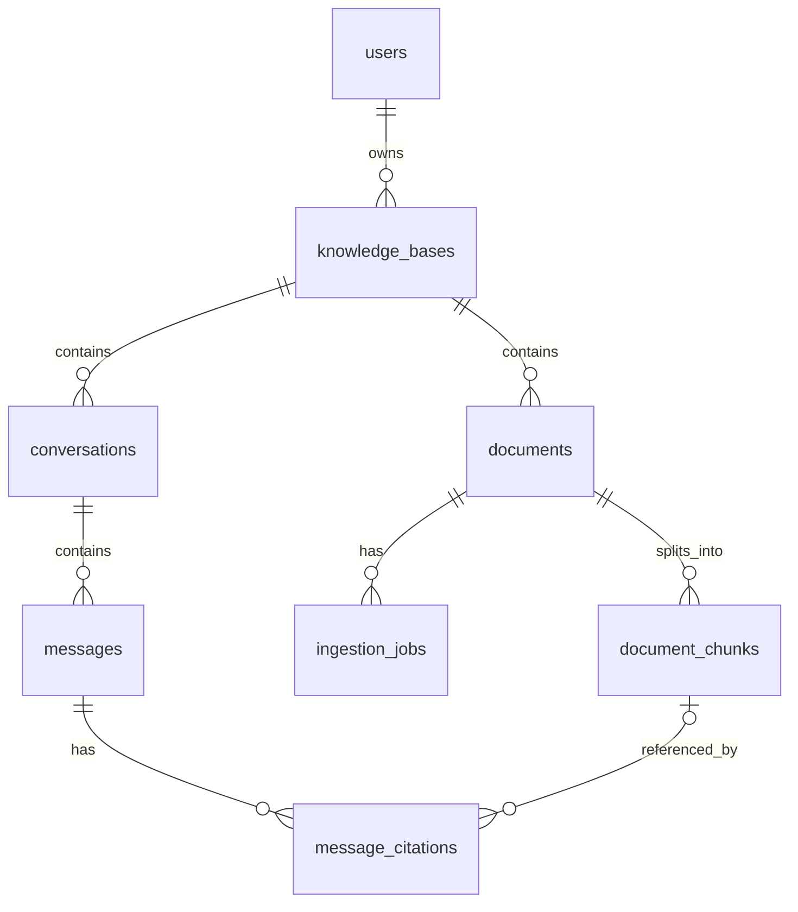

---
tags:
  - MySQL
  - 数据库
  - 数据库设计
  - 范式
updated: "2026-08-15"
status: 已完成八表设计与 MySQL 运行验证，待路线项目综合巩固
---

# DB-08：项目数据库设计

> 本节目标：把已经学过的表、约束、查询、事务和索引用于个人知识库项目，能够说明为什么这样拆表、怎样保护用户隔离、如何处理唯一与删除规则，并最终冻结八张表的 ER、DDL 和数据字典。

## 1. 数据库设计解决什么问题

前面的 SQL 主要回答“怎样操作数据”，数据库设计回答：

```text
项目需要哪些表？
每张表保存什么？
表与表怎样关联？
哪些数据不能重复？
删除父记录时，子记录怎么办？
怎样阻止跨用户访问和非法状态？
```

个人知识库项目的三个基础事物是：

```text
用户 → 知识库 → 文档
```

先得到三张基础表：

```text
users
knowledge_bases
documents
```

基本原则：

> 一张表主要保存一种事物；描述谁的信息，就优先放进谁的表。

## 2. 主键、外键与一对多

示例数据：

```text
users
id | email
1  | xiaoming@example.com

knowledge_bases
id | user_id | name
10 | 1       | MySQL学习

documents
id  | knowledge_base_id | title
100 | 10                | SQL基础.md
101 | 10                | JOIN练习.md
```

含义：

```text
users.id                         → 用户自己的编号
knowledge_bases.id               → 知识库自己的编号
knowledge_bases.user_id          → 知识库属于哪个用户
documents.id                     → 文档自己的编号
documents.knowledge_base_id      → 文档属于哪个知识库
```

可以沿着外键得到所有权链：

```text
文档 100
→ knowledge_base_id = 10
→ 知识库 10 的 user_id = 1
→ 最终属于用户 1
```

记忆：

```text
主键：我是谁
外键：我属于谁或我关联谁
```

一个用户可以拥有多个知识库，一个知识库只能属于一个用户：

```text
users 1 ─── N knowledge_bases
```

一个知识库可以包含多篇文档，一篇文档只能属于一个知识库：

```text
knowledge_bases 1 ─── N documents
```

一对多关系的外键通常放在“多”的一方。主键与引用它的外键必须使用兼容的数据类型，包括 signed/unsigned 属性一致。

基础外键示例：

```sql
CONSTRAINT fk_knowledge_bases_user
    FOREIGN KEY (user_id)
    REFERENCES users(id)
```

外键会拒绝不存在的所属关系，但不会自动完成用户权限检查。

## 3. 为什么要拆表

把所有数据塞进一张表会大量重复：

```text
document_records
---------------------------------------------------------------------------
文档ID | 文档标题    | 知识库ID | 知识库名称 | 用户ID | 用户邮箱
100    | SQL基础.md  | 10       | MySQL学习  | 1      | xiaoming@example.com
101    | JOIN练习.md | 10       | MySQL学习  | 1      | xiaoming@example.com
```

问题包括：

- 用户邮箱和知识库名称随文档重复。
- 知识库改名时需要修改多行，漏改会产生矛盾数据。
- 删除最后一篇文档时，不应该同时丢失用户和知识库信息。
- 没有文档时也应该能够先创建空知识库。

拆分后，每个事实主要保存一次：

```text
users                → 用户邮箱
knowledge_bases      → 知识库名称和所属用户
documents            → 文档标题和所属知识库
```

## 4. 三范式的实用理解

### 4.1 第一范式：一个格子保存一个值

错误示例：

```text
knowledge_bases.document_ids = "100,101,102"
```

一个字段塞入多个文档 ID 后，很难建立外键、精确查询和安全修改。正确方式是让每篇文档单独一行：

```text
documents
id  | knowledge_base_id
100 | 10
101 | 10
102 | 10
```

记忆：

> 不要用逗号、空格或其他分隔符在一个字段中保存多个同类值。

### 4.2 第二范式：字段依赖完整联合主键

第二范式主要检查联合主键。教学示例：

```text
favorites
----------------------------------------------------------------
user_id | document_id | user_email | document_title | favorited_at
```

联合主键为：

```sql
PRIMARY KEY (user_id, document_id)
```

依赖关系：

```text
user_id + document_id → favorited_at
user_id               → user_email
document_id           → document_title
```

`favorited_at`描述“某个用户收藏某篇文档”这段关系，可以留在关系表。`user_email`只描述用户，`document_title`只描述文档，应分别放进 `users` 与 `documents`。

记忆：

> 如果主键由多个字段组成，其他字段不能只描述主键的一部分。

### 4.3 第三范式：普通字段不依赖另一个普通字段

错误设计：

```text
documents
------------------------------------------------
id | knowledge_base_id | knowledge_base_name | title
```

依赖关系：

```text
document.id → knowledge_base_id → knowledge_base_name
```

知识库名称描述知识库，不描述文档，应放进 `knowledge_bases`。需要同时显示文档和知识库名称时使用 `JOIN`：

```sql
SELECT
    d.id,
    d.title,
    kb.name AS knowledge_base_name
FROM documents AS d
INNER JOIN knowledge_bases AS kb
    ON kb.id = d.knowledge_base_id;
```

记忆：

> 一张表的普通字段应该直接描述这张表代表的事物。

### 4.4 三范式速记

```text
第一范式：一个格子不要塞多个值
第二范式：联合主键中，字段不能只依赖主键的一部分
第三范式：普通字段不要依赖另一个普通字段
```

范式不是为了机械拆表，而是为了减少无意重复和不一致。有明确业务目的的历史快照可以有意冗余，但必须说明该字段是冻结值还是需要同步的副本。例如 `message_citations` 保存消息生成当时的来源标题和引用文本快照，可以保证原 chunk 删除后历史引用仍能显示。

## 5. 主键唯一与业务唯一

```text
PRIMARY KEY → 标识一条记录是谁
UNIQUE      → 防止业务上不允许的重复
```

用户邮箱在系统内唯一：

```sql
CONSTRAINT uq_users_email
    UNIQUE (email)
```

同一用户不能拥有两个同名知识库，但不同用户可以使用相同名称：

```sql
CONSTRAINT uq_knowledge_bases_user_name
    UNIQUE (user_id, name)
```

同一知识库不能重复上传内容相同的文件，但同一文件可以存在于不同知识库：

```sql
CONSTRAINT uq_documents_kb_content_hash
    UNIQUE (knowledge_base_id, content_hash)
```

这里的联合唯一约束表达“在某个范围内唯一”：

```text
(user_id, name)                       → 在同一用户范围内名称唯一
(knowledge_base_id, content_hash)    → 在同一知识库范围内内容唯一
```

软删除后的文档记录仍然占用联合唯一组合。相同内容再次上传时，应用应恢复或重新处理原记录，而不是创建第二条重复活动记录。

## 6. 用户隔离

危险查询只按资源 ID 查找：

```sql
SELECT *
FROM documents
WHERE id = :document_id;
```

如果用户修改 URL 中的文档 ID，这种查询可能返回其他用户的数据。正确查询需要沿着关系检查资源最终属于当前登录用户：

```sql
SELECT d.*
FROM documents AS d
INNER JOIN knowledge_bases AS kb
    ON kb.id = d.knowledge_base_id
WHERE d.id = :document_id
  AND kb.user_id = :current_user_id;
```

其中：

- `document_id` 可以来自请求路径。
- `current_user_id` 必须来自服务端验证后的登录身份，不能相信客户端提交的所有者字段。

需要区分：

```text
外键约束   → 保证父记录存在
所有权过滤 → 保证资源属于当前用户
```

项目所有权链：

```text
用户
└── 知识库
    ├── 文档
    └── 会话
        └── 消息
```

查询子资源时不能只按其主键查询，必须确认整条所有权链。

## 7. 外键删除策略

### 7.1 RESTRICT

```sql
ON DELETE RESTRICT
```

父记录仍有子记录时拒绝删除，适合防止误删重要数据。

### 7.2 CASCADE

```sql
ON DELETE CASCADE
```

删除父记录时自动删除相关子记录。它很方便，但误删父记录可能造成大范围数据丢失。

### 7.3 SET NULL

```sql
ON DELETE SET NULL
```

保留子记录并把外键设为 `NULL`；外键列必须允许空值。它适合需要保留历史记录、但原目标允许消失的关系。

速记：

```text
RESTRICT → 有孩子，不让删
CASCADE  → 父记录删除，孩子一起删
SET NULL → 保留孩子，解除关系
```

项目 P0 对知识库使用保护性删除：只允许删除没有任何会话和文档记录的空知识库。因此知识库到 `documents`、`conversations` 的关系应使用明确的 `ON DELETE RESTRICT`。

非空知识库删除还涉及 MySQL、向量数据库和可能的文件存储，数据库级联无法清理外部系统，不能只依赖 `CASCADE`。

## 8. 状态、审计时间与软删除

文档可能经历以下状态：

```text
pending → processing → ready
                     ↘ failed
ready/failed → deleting → deleted
```

状态字段示例：

```sql
status VARCHAR(20) NOT NULL DEFAULT 'pending',

CONSTRAINT ck_documents_status
CHECK (
    status IN (
        'pending',
        'processing',
        'ready',
        'failed',
        'deleting',
        'deleted'
    )
)
```

`CHECK` 限制允许出现的状态值，合法的状态迁移仍由业务层控制。

常见审计时间：

```sql
created_at DATETIME(6) NOT NULL DEFAULT CURRENT_TIMESTAMP(6),
updated_at DATETIME(6) NOT NULL
    DEFAULT CURRENT_TIMESTAMP(6)
    ON UPDATE CURRENT_TIMESTAMP(6),
deleted_at DATETIME(6) NULL
```

项目统一用 UTC 保存和解释审计时间，数据库连接的 session 时区也必须明确设为 UTC。

软删除不直接移除文档，而是更新状态与删除时间：

```sql
UPDATE documents
SET
    status = 'deleted',
    raw_content = NULL,
    deleted_at = UTC_TIMESTAMP(6)
WHERE id = :document_id;
```

正常列表必须排除软删除记录：

```sql
WHERE deleted_at IS NULL
```

完整删除流程应先进入 `deleting`，立即从正常查询和检索中排除，再清理外部向量和相关数据，最后进入 `deleted` 并记录 `deleted_at`。

## 9. 稳定排序、深页分页与索引预留

offset 分页示例：

```sql
ORDER BY created_at DESC
LIMIT 20 OFFSET 19980;
```

深页时，MySQL 可能仍需定位并跳过大量前置记录。翻页过程中发生插入或删除，还可能造成记录重复或遗漏。

只按时间排序也不稳定，因为多行可能拥有相同时间。使用唯一主键作为第二排序字段：

```sql
ORDER BY created_at DESC, id DESC
```

游标使用上一页最后一行的 `(created_at, id)`：

```sql
SELECT id, title, created_at
FROM documents
WHERE knowledge_base_id = :knowledge_base_id
  AND deleted_at IS NULL
  AND (
        created_at < :cursor_created_at
        OR (
            created_at = :cursor_created_at
            AND id < :cursor_id
        )
      )
ORDER BY created_at DESC, id DESC
LIMIT 20;
```

候选联合索引：

```sql
CREATE INDEX idx_documents_kb_deleted_created_id
ON documents (
    knowledge_base_id,
    deleted_at,
    created_at,
    id
);
```

```text
数据少、页码浅、需要跳页 → offset 简单
数据多、连续向后加载       → 游标通常更稳定
```

DB-08 只要求理解问题并预留稳定排序与联合索引；完整游标 API 属于拓展项。

## 10. 密码、敏感信息与最小权限

密码必须由成熟密码哈希库处理，只保存哈希结果：

```sql
password_hash VARCHAR(255) NOT NULL
```

禁止保存明文密码，也不能自行发明密码哈希算法。

以下信息不得提交到 Git 或写入普通日志：

```text
明文密码
完整 JWT
API Key
数据库密码和完整连接串
完整敏感文档
完整敏感 Prompt
```

日志可以记录必要的请求 ID、路径、状态码、耗时、用户 ID 和错误类型。数据库内部错误应映射为安全的业务错误，不能原样返回客户端。

应用运行账号不能使用 `root`，通常只授予指定 schema 的日常 CRUD 权限：

```sql
GRANT SELECT, INSERT, UPDATE, DELETE
ON personal_knowledge_base.*
TO 'pkb_app'@'%';
```

部署迁移使用独立迁移账号；管理员账号只用于受控管理。普通应用账号不应拥有 `DROP DATABASE`、`CREATE USER`、`GRANT` 和 `FILE` 等高风险权限。

外部输入必须参数化，不能拼接 SQL：

```sql
SELECT *
FROM users
WHERE email = :email;
```

## 11. 当前设计原则汇总

```text
一张表主要保存一种事物
主键标识自己，外键表达关系
外键字段放在一对多关系的“多”方
无意重复的数据按范式拆分
业务唯一性使用单列或联合 UNIQUE
每次资源查询都验证当前用户的所有权
所有外键显式声明 ON DELETE 行为
状态与时间字段表达完整生命周期
软删除数据默认从活动查询中排除
列表使用稳定排序，并为游标分页预留索引
密码只存哈希，密钥不入库不入日志
应用数据库账号遵守最小权限
```

## 12. 最终八表关系



```text
users
└── knowledge_bases
    ├── conversations
    │   └── messages
    │       └── message_citations
    └── documents
        ├── ingestion_jobs
        └── document_chunks
            └── message_citations
```

`message_citations` 同时依赖 `messages` 和 `document_chunks`，因此最后创建。删除表时按相反顺序操作。

最终字段、空值、默认值和约束见：[个人知识库数据库数据字典](./个人知识库数据库/数据字典.md)。

权威手写 DDL：[schema.sql](./个人知识库数据库/schema.sql)。

## 13. 本轮运行验证

使用隔离的一次性 MySQL 8.0.46 实例，从空数据库执行最终 `schema.sql`，八张表全部创建成功。该版本验证用于提前发现语法和约束错误；项目目标版本仍为 MySQL 8.4。

实际验证通过：

1. 正常种子数据可以写入全部八张表。
2. 重复邮箱被 `uq_users_email` 拒绝。
3. 不存在的 `user_id` 被外键拒绝。
4. 同一用户的重复知识库名称被联合唯一约束拒绝，不同用户同名允许。
5. 非法消息角色与非法文档状态被 `CHECK` 拒绝。
6. 同一知识库重复 `content_hash` 被拒绝，不同知识库相同 hash 允许。
7. 没有 lease 的 `processing` 摄取任务被拒绝。
8. 非空知识库删除被 `ON DELETE RESTRICT` 拒绝。
9. chunk 物理删除后，citation 的 `chunk_id` 自动置空，标题和引用正文快照保留。
10. 会话删除后，其 messages 与 message_citations 按设计级联删除。
11. 删除文档后重新上传会恢复原记录、递增 `ingestion_generation`，并创建新一代 ingestion job。

验证使用的临时 MySQL 实例和数据目录已经正常关闭并清理，没有修改本机正在运行的 `MySQL80` 服务。

## 14. 当前完成状态

状态：`[已完成八表设计与 MySQL 运行验证，待路线项目综合巩固]`。

DB-08 已完成设计原则、最终 ER、八表手写 DDL、数据字典、设计取舍和约束运行验证。手写 DDL 是 SQL 学习产物；应用接入后，Alembic migration 是数据库结构变更的唯一权威来源。

固定种子数据已经完成并通过空库运行验证：[seed_data.sql](./个人知识库数据库/seed_data.sql)。最终数据规模为 3 个用户、4 个知识库、4 个会话、10 条消息、8 篇文档、9 次摄取、6 个 chunk 和 4 条引用。

种子专门覆盖无知识库用户、空知识库、无消息会话、六种文档状态、跨用户同名知识库、跨知识库相同内容 hash、相同创建时间的稳定排序、可空 chunk 来源和 `chunk_id=NULL` 的历史引用。

下一步进入 MySQL 路线项目综合巩固：实际完成 8 道单表、4 道统计、6 道多表查询，一次失败回滚、双连接并发实验和三份索引执行计划。
